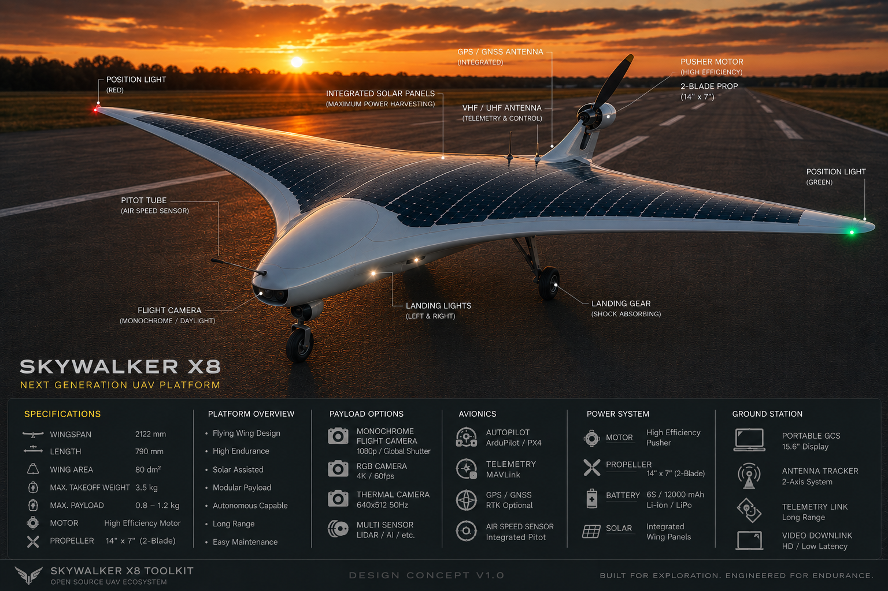

# Skywalker X8 Toolkit

> Building an open-source ecosystem for the Skywalker X8: telemetry, diagnostics, ground station, sensors, avionics and autonomous flight.

---

## Overview

The Skywalker X8 Toolkit is an open-source development project for long-endurance UAV systems based on the Skywalker X8 platform.

The goal is not only to build a capable UAV, but also to develop the complete software and hardware ecosystem around it. Every module is designed to be reusable, modular and well documented.

---

## Current Development Focus

- ZTW Mantis G2 telemetry decoder
- UART communication tools
- Live telemetry monitor
- Snapshot and logging tools
- ESC protocol documentation

---

## Planned Features

### Telemetry

- ESP32 telemetry bridge
- MAVLink output

### Ground Station

- Live telemetry dashboard
- Mission planning
- Flight recording
- System diagnostics

### Hardware

- Skywalker X8 integration
- Camera gimbal
- Sensor modules
- Power monitoring
- Solar power management

### Software

- Python development toolkit
- Data analysis tools
- Log file viewer
- Configuration utilities

---

## Project Goals

This project aims to create a professional, open and well documented toolkit that can be used by hobbyists, researchers and UAV developers.

The project focuses on:

- Reliability
- Modularity
- Documentation
- Open Source
- Community collaboration

---

## Current Status

The first telemetry core milestone is implemented and validated.

Completed:

- Serial telemetry reader for ZTW Mantis G2 ESC telemetry
- Frame synchronization and checksum validation
- Decoded telemetry frame representation
- Rolling telemetry statistics
- Current calibration tool with averaged snapshots
- Experimental current characterization
- Independent verification of the current calibration model

Validation results:

- Mean absolute error: 0.18 A
- RMSE: 0.20 A
- Maximum error: 0.32 A

The current calibration has been validated for the tested hardware configuration and is documented in Issue #1.

---

## Project Progress

- [x] ESC Telemetry Core
- [ ] MAVLink Interface
- [ ] Ground Station
- [ ] Camera Gimbal
- [ ] Sensor Fusion
- [ ] Flight Integration
- [ ] Autonomous Mission Support

---

## Roadmap

### Version 0.x

- UART communication
- Telemetry decoder
- Diagnostic tools

### Version 1.x

- Complete telemetry toolkit
- ESP32 support
- Ground station software

### Future

- Autonomous flight support
- Modular payload system
- Advanced sensor integration

---

## License

This project is released under the MIT License.

---

## Acknowledgements

Special thanks to **ZTW Model** for providing the official telemetry protocol documentation for the Mantis G2 ESC series.

---

## Author

Torsten

Germany

---

## Contributing

Ideas, bug reports and pull requests are always welcome.
